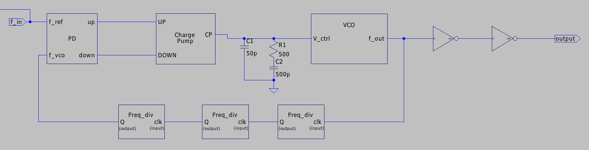

# Transistor Level Design & implementation of PLL

This repository contains the LaTeX-based documentation and design files for a Phase-Locked Loop (PLL) system. The project focuses on the design, simulation, and analysis of PLL components and their integration into a complete system.

## Table of Contents
- [Overview](#overview)
- [Components](#components)
- [Design Methodology](#design-methodology)
- [Simulations](#simulations)
- [Usage](#usage)
- [Folder Structure](#folder-structure)
- [License](#license)

## Overview
A Phase-Locked Loop (PLL) is a negative feedback control system used to synchronize the phase and frequency of an output signal with a reference signal. This project documents the design and implementation of a PLL using LTSpice simulations and LaTeX for reporting.

## Components
The PLL consists of the following key components:
1. **Phase Detector (PD) / Phase Frequency Detector (PFD)**: Measures phase and frequency differences between reference and feedback signals.
2. **Charge Pump (CP)**: Converts phase error signals into control voltages.
3. **Low Pass Filter (LPF)**: Smoothens the control voltage by removing high-frequency noise.
4. **Voltage-Controlled Oscillator (VCO)**: Generates an output signal whose frequency is controlled by the input voltage.
5. **Frequency Divider (FD)**: Divides the VCO output frequency to match the reference signal.

## Design Methodology
The design process includes:
- **Component Design**: Each block (PFD, CP, LPF, VCO, FD) is designed and simulated individually.
- **Integration**: The blocks are combined to form a complete PLL system.
- **Optimization**: Practical considerations like dead zones, ripple effects, and stabilization are addressed.

## Simulations
Simulations are performed using LTSpice to validate the functionality of each component and the complete PLL system. Key results include:
- Transient analysis of individual blocks.
- Frequency and phase locking behavior of the PLL.
- Output waveforms for each stage.

## Usage
1. Clone the repository:
   ```bash
   git clone https://github.com/your-username/PLL-Design.git
2. Navigate to the fyp_report folder to view the LaTeX files.
3. Compile the LaTeX files using a LaTeX editor or command-line tools:
   ```bash
   pdflatex thesis.tex

##Folder Structure
fyp_report/<br />
├── main/ <br />
│   ├── thesis.tex          # Main LaTeX file<br />
│   ├── chapters/<br />
│   │   ├── [Methodology.tex](http://_vscodecontentref_/0) # Methodology and design details<br />
│   │   ├── Abstract.tex    # Abstract of the report<br />
│   │   ├── Results.tex     # Simulation results<br />
│   │   └── ...             # Other chapters<br />
│   ├── figs/               # Figures and diagrams<br />
│   └── defs.tex            # Custom LaTeX definitions<br />
└── [README.md](http://_vscodecontentref_/1)               # Project documentation<br />

