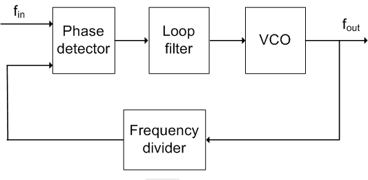

# Transistor Level Implementation of Phase Locked Loop (PLL)

**Mohammed Hamza, Nanda Kishore, Mohammad Daanish Hassain, Pavan Kumar G, Vaibhav Burli V**  
**Guide: Dr. B.P Harish**  
** ECE dept UVCE, Bangalore**

---

## Abstract

- Objective: Design a transistor-level PLL using 180 nm CMOS in LTspice.
- Key Components:
  - Phase Frequency Detector (PFD)
  - Charge Pump (CP)
  - Low Pass Filter (LPF)
  - Voltage-Controlled Oscillator (VCO)
  - Frequency Divider
- Applications: Clock generation, frequency synthesis, RFICs

---

## Motivation

- Understand the working of PLLs at the transistor level.
- Gain simulation experience using LTspice.
- Apply theory to practical RF design.

---

## Fundamentals of PLLs

- PLL: Feedback system to lock output phase to input reference.
- Key Parameters:
  - Bandwidth
  - Natural frequency (ωₙ)
  - Damping factor (ζ)

---

## Block Diagram of PLL

  

- Components:
  - PFD
  - Charge Pump
  - LPF
  - VCO
  - Frequency Divider

---

## Design Overview

### 1. Phase Frequency Detector (PFD)

- Built using NAND and D Flip-Flops.
- Generates UP and DOWN signals to CP.

---

### 2. Charge Pump

- Converts PFD signals to control voltage.
- Implemented with drain-switched current sources.

Equation:
\[
I_{OUT} = I_{UP} - I_{DOWN}
\]

---

### 3. Low Pass Filter (LPF)

- Filters out high-frequency noise from the charge pump.
- Typically implemented as a passive RC filter.

\[
V_{CTRL}(s) = \frac{I_{OUT}}{sC + \frac{1}{R}}
\]

---

### 4. Voltage-Controlled Oscillator (VCO)

- Converts control voltage to output frequency.
- Implemented using current-starved ring oscillator.

\[
f_{out} = f_{free} + K_{VCO} \cdot V_{CTRL}
\]

---

### 5. Frequency Divider

- Divides VCO output frequency for feedback.
- Implemented using flip-flops or counters.

---

## Simulation Results

- LTspice waveforms for each block.
- Demonstrated phase locking and frequency synthesis.

---

## Applications

- Clock recovery in communication systems.
- Frequency synthesis in RF transceivers.
- Jitter reduction in digital circuits.

---

## Conclusion

- Successfully designed and simulated a PLL at transistor level.
- Gained practical insights into analog and mixed-signal design.

---

## References

1. Razavi, B. "Design of Analog CMOS Integrated Circuits"
2. Baker, R. "CMOS: Circuit Design, Layout, and Simulation"
3. LTspice Documentation
---

## Thank You

**Questions?**

  

